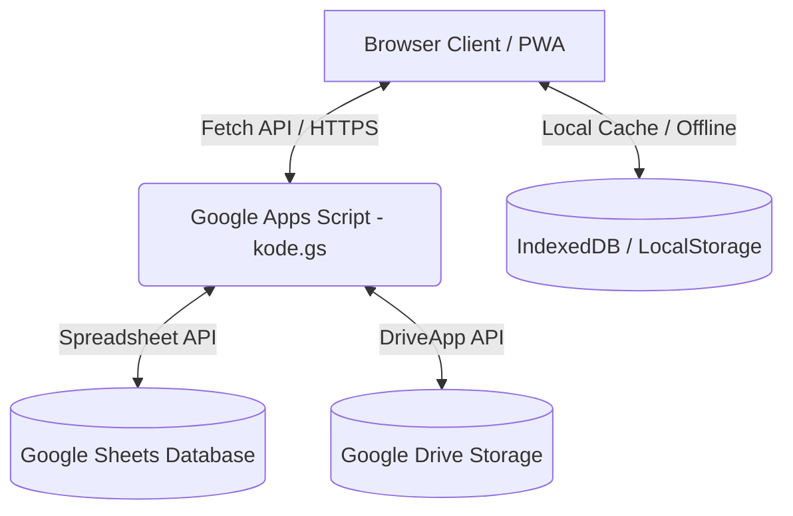

# Kelola FPManager 📂📈

Kelola FPManager adalah aplikasi mini-ERP berbasis web luring (*Progressive Web App*) yang didesain khusus untuk mengelola operasional usaha kecil, studio kreatif, atau jasa percetakan secara mandiri tanpa memerlukan server berbayar. Aplikasi ini menggunakan **HTML5/Tailwind CSS/JavaScript Vanilla** di sisi frontend dan **Google Spreadsheet** sebagai basis data melalui perantara **Google Apps Script API**.

---

## 🏗️ Arsitektur Sistem

Aplikasi ini menggunakan arsitektur **Serverless Frontend-Heavy** dengan basis data relasional terdistribusi antara IndexedDB lokal dan Google Sheets.



*   **Frontend**: HTML5, Vanilla JavaScript, CSS3 (Tailwind CSS v2 Terlokalisasi), IndexedDB (Penyimpanan Offline), & Service Worker (PWA Offline).
*   **Backend**: Google Apps Script (Web App Endpoint) dengan proteksi persaingan data (*concurrency locking*).
*   **Database**: Google Sheets (Tabel: `Users`, `Proyek`, `Keuangan`, `UserPermissions`).
*   **Penyimpanan Gambar**: Google Drive (Folder ID: `1ps66jVi9PYmw8a9BWV_tgyBjYsiKnKXE`).

---

## 🎨 Desain Antarmuka Pengguna & Estetika (UI/UX)

Aplikasi FPManager dikembangkan dengan standar visual premium dan responsif demi kenyamanan operasional harian:

### 1. Palet Warna & Tema Dinamis
*   **Mode Terang (Light Mode)**: Menggunakan kombinasi kontras tinggi dengan warna latar dasar `Zinc-50` (`#fafafa`) dan aksen utama `Indigo-600` (`#4f46e5`) untuk elemen interaktif seperti tombol aksi dan tautan navigasi aktif.
*   **Mode Gelap (Dark Mode)**: Didukung penuh menggunakan variabel CSS HSL di [`css/darkmode.css`](file:///c:/Users/user/Desktop/FPManager/css/darkmode.css). Latar belakang menggunakan warna gelap pekat `Zinc-950` untuk panel dasar, `Zinc-900` untuk kontainer kartu, dan kontras teks cerah `Zinc-100` untuk mengurangi kelelahan mata.

### 2. Layout Adaptif & Responsif (Mobile-First)
*   **Layout Desktop (Layar Lebar)**: Menggunakan bilah menu samping (*Sidebar Navigation aside*) tetap yang dapat diciutkan (*collapsible*) menjadi versi mini icon saja untuk memberikan area kerja utama yang luas bagi manajemen tabel.
*   **Layout Mobile (HP / Tablet)**: Bilah menu samping disembunyikan secara otomatis dan dialihkan menjadi bilah menu lekat di bagian bawah (*Fixed Bottom Navigation Bar*). Area konten secara otomatis menyesuaikan dengan menyisipkan padding bawah `pb-[76px]` agar elemen terbawah tidak tertutup oleh bilah navigasi.

### 3. Efek Glassmorphism & Interaksi Mikro
*   **Glassmorphism**: Kartu ringkasan dasbor menggunakan efek semi-transparan `glass-panel` dengan filter pemburaman latar belakang (`backdrop-filter: blur(12px)`) yang memberikan nuansa premium modern.
*   **Micro-Interactions**: Tombol dan kartu dilengkapi dengan efek transisi melayang `hover-card` (translasi vertikal `translate-y-[-2px]` dan bayangan halus `box-shadow`) yang merespons gerakan kursor secara interaktif.

### 4. Notifikasi Pop-up (Toast) & Modalnya
*   **Custom Toast**: Pesan peringatan dan sukses didesain sebagai notifikasi melayang di sudut layar. Di bagian bawah setiap Toast terdapat indikator durasi horizontal (*progress bar*) yang menyusut mundur sebagai timer visual penutupan notifikasi.
*   **Sleek Modal Form**: Formulir pengisian data dirancang dalam bentuk kotak dialog modal yang halus dengan latar belakang gelap buram (*backdrop overlay blur*) saat aktif.

---

## 📂 Struktur Direktori & Modul Berkas

```bash
FPManager/
├── css/
│   ├── style.css           # Styling kustom & animasi transisi panel
│   ├── darkmode.css        # Variabel warna & tema gelap
│   └── tailwind.min.css    # Pustaka framework Tailwind CSS v2 (Terlokalisasi Offline)
├── js/
│   ├── api.js              # Controller komunikasi data Sheets API & Mesin Offline Queue
│   ├── auth.js             # Validasi hak akses role-based & kontrol menu dinamis
│   ├── calendar.js         # Eksportir berkas iCal (.ics) & template Google Calendar
│   ├── config.js           # Getters/Setters konfigurasi aplikasi di LocalStorage
│   ├── dashboard.js        # Logic perhitungan dasbor, grafik Chart.js, & pengingat
│   ├── excel.js            # Modul ekspor tabel proyek ke format spreadsheet Excel (.xlsx)
│   ├── i18n.js             # Manajemen pelokalan bahasa (ID / EN)
│   ├── invoice.js          # Generator template nota pembayaran & ekspor PDF
│   ├── keuangan.js         # Handler formulir & mutasi kas masuk/keluar keuangan
│   ├── laporan.js          # Logic pemrosesan analitik laba rugi & omzet bulanan
│   ├── pengaturan.js       # Kontrol ekspor-impor database lokal cadangan
│   ├── profil.js           # Pengolah data pengguna & interseptor upload foto profil GDrive
│   ├── proyek.js           # Logic pencarian, pagination, filter, & integrasi WhatsApp
│   ├── pwa.js              # PWA install banner prompt & liveness detector
│   ├── tambah.js           # Validasi formulir pendaftaran proyek baru
│   ├── theme.js            # Switcher tema gelap/terang
│   └── toast.js            # Sistem notifikasi pop-up cantik yang dinamis
├── index.html              # Halaman Dashboard Utama
├── proyek.html             # Daftar Manajemen Proyek (DataTables)
├── tambah-proyek.html      # Formulir Input & Edit Proyek
├── keuangan.html           # Pencatatan Buku Kas & Mutasi Keuangan
├── laporan.html            # Laporan Keuangan Tahunan & Grafik
├── layanan.html            # Modul Daftar Harga & Jenis Layanan
├── tools.html              # Pusat Prompt AI, Pintasan, & Referensi Desain
├── profil.html             # Halaman Pengaturan Akun & Unggah Foto
├── invoice.html            # Pratinjau & Cetak Nota Pembayaran
├── login.html              # Halaman Masuk Akun Pengguna
├── user-management.html    # Modul Manajemen User & Hak Akses Modular (Super Admin Only)
├── manifest.json           # PWA Manifest metadata
├── sw.js                   # Service Worker untuk Caching Berkas Luring
└── kode.gs                 # Backend Google Apps Script (Keamanan, Upload Drive, & DB Sheets)
```

---

## 🗄️ Skema Database Google Sheets

Aplikasi secara otomatis membuat sheet dan kolom berikut pada inisialisasi pertama kali:

### 1. Sheet `Users`
Menampung data login administrator dan staf.
*   **Kolom**: `ID` | `Username` | `Password` (Ter-hash SHA-256) | `Role` | `Name` | `Permissions` | `CreatedAt` | `Email` | `Phone` | `Avatar` (Link URL Drive)

### 2. Sheet `Proyek`
Menampung data transaksi proyek pesanan pelanggan.
*   **Kolom**: `ID Proyek` | `Tanggal` | `Nama Proyek` | `Pelanggan` | `Nomor WA` | `Produk` | `Jumlah` | `Satuan` | `Harga Satuan` | `Nominal Proyek` | `DP` | `Sisa Pembayaran` | `Deadline` | `Status` | `Catatan` | `Link Drive` | `User ID` | `Last Updated` (Timestamp Milidetik)

### 3. Sheet `Keuangan`
Menampung data pencatatan buku kas masuk/keluar.
*   **Kolom**: `ID` | `Tanggal` | `Jenis` | `Keterangan` | `Nominal`

### 4. Sheet `UserPermissions`
Menampung detail hak akses modular (*granular permissions*) per pengguna.
*   **Kolom**: `UserID` | `Username` | `proyek_read` | `proyek_create` | `proyek_update` | `proyek_delete` | `keuangan_read` | ... (dan seterusnya untuk seluruh action permissions).

---

## 🛡️ Fitur Keamanan & Sinkronisasi Luring Utama

### 🔒 1. Hashing Kredensial SHA-256 ([`kode.gs`](file:///c:/Users/user/Desktop/FPManager/kode.gs))
Sistem login tidak lagi menyimpan password dalam bentuk teks biasa. Semua password dienkripsi secara aman menggunakan fungsi kriptografi SHA-256 pada backend Apps Script. Sistem juga dilengkapi fitur **Auto-Migration** yang otomatis mengubah password teks biasa lama menjadi hash SHA-256 saat user melakukan login sukses berikutnya.

### 📡 2. Sinkronisasi Antrean Luring & Resolusi Konflik ([`js/api.js`](file:///c:/Users/user/Desktop/FPManager/js/api.js))
*   **ID Proyek Sementara**: Saat perangkat offline, proyek baru diberikan ID sementara `OFFLINE-PRJ-[timestamp]` dan antrean disimpan ke IndexedDB. Saat online, ID sementara ini ditukar secara otomatis dengan ID resmi dari Sheets melalui sistem `idMap`.
*   **Deteksi Konflik (Data Stale)**: Kolom `Last Updated` membandingkan timestamp revisi klien dengan server. Jika data di Google Sheets ternyata lebih baru dibandingkan versi offline klien, perubahan offline akan diabaikan secara aman (*stale check*) dan memunculkan notifikasi peringatan konflik sinkronisasi demi mencegah kerusakan data.
*   **Keandalan Antrean**: Berbeda dari PWA standar, antrean di IndexedDB dihapus satu per satu hanya setelah menerima response sukses 200 dari server Google Apps Script. Jika koneksi mati di tengah proses, sisa antrean tetap disimpan dengan aman.

### 📁 3. Penyimpanan Gambar Google Drive Terintegrasi
Gambar profil pengguna yang diunggah dikonversi ke Base64, dikirim ke Apps Script, lalu didekode menjadi berkas gambar asli dan disimpan ke dalam folder Google Drive khusus. Spreadsheet hanya menyimpan tautan URL publik gambar tersebut. Hal ini membuat database Google Sheets tetap berukuran kecil dan berjalan sangat cepat.

---

## 🚀 Panduan Instalasi & Deployment

### 1. Konfigurasi Tailwind CSS (Mode Offline vs. Online CDN)
Aplikasi ini dikonfigurasi menggunakan **Tailwind CSS v2.2.19** lokal untuk memastikan aplikasi dapat berjalan 100% secara offline saat diinstal sebagai PWA.
*   **Instalasi Offline (Default)**: File CSS diletakkan secara lokal di [`css/tailwind.min.css`](file:///c:/Users/user/Desktop/FPManager/css/tailwind.min.css) dan dipanggil pada berkas HTML menggunakan:
    ```html
    <link href="css/tailwind.min.css" rel="stylesheet">
    ```
    Aset lokal ini didaftarkan di dalam cache whitelist `sw.js` agar di-caching browser secara otomatis.
*   **Instalasi Online (CDN Alternatif)**: Jika Anda ingin kembali menggunakan CDN online, Anda dapat mengubah baris tautan di semua file `.html` menjadi:
    ```html
    <link href="https://cdn.jsdelivr.net/npm/tailwindcss@2.2.19/dist/tailwind.min.css" rel="stylesheet">
    ```

---

### 2. Panduan Deployment Backend Google Apps Script
Untuk menghubungkan frontend aplikasi dengan database Google Sheets Anda:

1.  Buat Google Spreadsheet baru di Google Drive Anda.
2.  Pilih menu **Extensions** > **Apps Script**.
3.  Salin seluruh kode dari file [`kode.gs`](file:///c:/Users/user/Desktop/FPManager/kode.gs) di proyek ini dan tempelkan ke editor Apps Script Anda (hapus kode bawaan `myFunction`).
4.  Ganti nilai `FOLDER_PARENT_ID` pada baris ke-8 jika Anda ingin menggunakan folder Google Drive pribadi Anda:
    ```javascript
    const FOLDER_PARENT_ID = "1ps66jVi9PYmw8a9BWV_tgyBjYsiKnKXE"; // Ganti dengan ID Folder Anda
    ```
5.  Klik ikon **Save** (Disket).
6.  Klik tombol **Deploy** di kanan atas, pilih **New Deployment**.
7.  Pilih jenis deployment: **Web App**.
    *   **Execute as**: *Me (email anda)*
    *   **Who has access**: *Anyone* (Agar API dapat diakses oleh browser klien)
8.  Klik **Deploy** dan berikan izin akses (*Authorize Access*) ke akun Google Anda.
9.  Salin **Web App URL** yang dihasilkan (contoh: `https://script.google.com/macros/s/.../exec`).
10. Tempelkan URL tersebut ke konfigurasi `API_URL` Anda di [`js/config.js`](file:///c:/Users/user/Desktop/FPManager/js/config.js#L5) atau melalui menu **Pengaturan** di dalam aplikasi web.